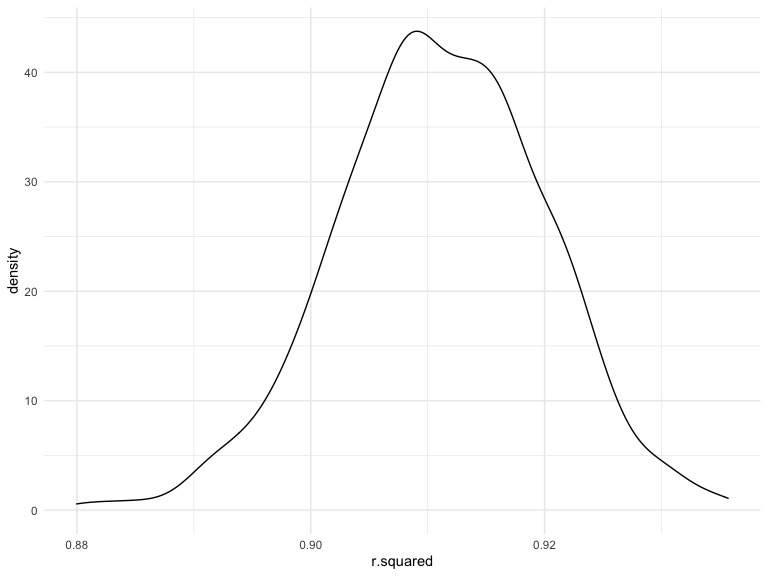
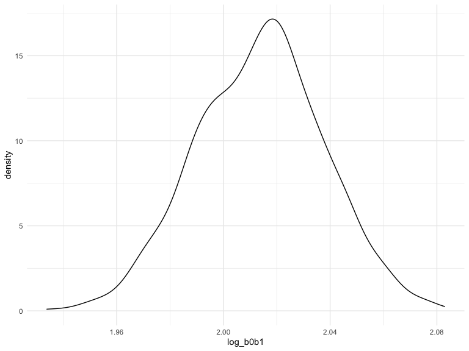

Homework 6
================
Jialu Cheng (jc5457)

``` r
library(tidyverse)
library(modelr)
```

### Problem 1

To obtain a distribution for $\hat{r}^2$, we’ll follow basically the
same procedure we used for regression coefficients: draw bootstrap
samples; the a model to each; extract the value I’m concerned with; and
summarize. Here, we’ll use `modelr::bootstrap` to draw the samples and
`broom::glance` to produce `r.squared` values.

``` r
weather_df = 
  rnoaa::meteo_pull_monitors(
    c("USW00094728"),
    var = c("PRCP", "TMIN", "TMAX"), 
    date_min = "2017-01-01",
    date_max = "2017-12-31") %>%
  mutate(
    name = recode(id, USW00094728 = "CentralPark_NY"),
    tmin = tmin / 10,
    tmax = tmax / 10) %>%
  select(name, id, everything())
```

    ## Registered S3 method overwritten by 'hoardr':
    ##   method           from
    ##   print.cache_info httr

    ## using cached file: ~/Library/Caches/R/noaa_ghcnd/USW00094728.dly

    ## date created (size, mb): 2022-09-29 10:32:06 (8.401)

    ## file min/max dates: 1869-01-01 / 2022-09-30

``` r
weather_df %>% 
  modelr::bootstrap(n = 1000) %>% 
  mutate(
    models = map(strap, ~lm(tmax ~ tmin, data = .x) ),
    results = map(models, broom::glance)) %>% 
  select(-strap, -models) %>% 
  unnest(results) %>% 
  ggplot(aes(x = r.squared)) + geom_density()
```



In this example, the $\hat{r}^2$ value is high, and the upper bound at 1
may be a cause for the generally skewed shape of the distribution. If we
wanted to construct a confidence interval for $R^2$, we could take the
2.5% and 97.5% quantiles of the estimates across bootstrap samples.
However, because the shape isn’t symmetric, using the mean +/- 1.96
times the standard error probably wouldn’t work well.

We can produce a distribution for $\log(\beta_0 * \beta1)$ using a
similar approach, with a bit more wrangling before we make our plot.

``` r
weather_df %>% 
  modelr::bootstrap(n = 1000) %>% 
  mutate(
    models = map(strap, ~lm(tmax ~ tmin, data = .x) ),
    results = map(models, broom::tidy)) %>% 
  select(-strap, -models) %>% 
  unnest(results) %>% 
  select(id = `.id`, term, estimate) %>% 
  pivot_wider(
    names_from = term, 
    values_from = estimate) %>% 
  rename(beta0 = `(Intercept)`, beta1 = tmin) %>% 
  mutate(log_b0b1 = log(beta0 * beta1)) %>% 
  ggplot(aes(x = log_b0b1)) + geom_density()
```



As with $r^2$, this distribution is somewhat skewed and has some
outliers.

The point of this is not to say you should always use the bootstrap –
it’s possible to establish “large sample” distributions for strange
parameters / values / summaries in a lot of cases, and those are great
to have. But it is helpful to know that there’s a way to do inference
even in tough cases.

### Problem 2

**Data Loading**

Loading the data that the Washington Post gathered on homicides in 50
large U.S. cities.

``` r
homicides = read_csv(file= "./data/homicide-data.csv") %>%
janitor::clean_names()
```

    ## Rows: 52179 Columns: 12
    ## ── Column specification ────────────────────────────────────────────────────────
    ## Delimiter: ","
    ## chr (9): uid, victim_last, victim_first, victim_race, victim_age, victim_sex...
    ## dbl (3): reported_date, lat, lon
    ## 
    ## ℹ Use `spec()` to retrieve the full column specification for this data.
    ## ℹ Specify the column types or set `show_col_types = FALSE` to quiet this message.

**Data Cleaning**

Create a `city_state` variable (e.g. “Baltimore, MD”), and a binary
variable `solved` indicating whether the homicide is solved.

Omit cities Dallas, TX; Phoenix, AZ; and Kansas City, MO – these don’t
report victim race. Also omit Tulsa, AL – this is a data entry mistake.

For this problem, limit your analysis those for whom `victim_race` is
`white` or `black`. Be sure that `victim_age` is numeric.

``` r
homicides_clean = 
  homicides %>%
  mutate(
    state = replace(state, state== "wI", "WI"),
    city_state= paste(city, state, sep= ","),
    solved = as.numeric(disposition == "Closed by arrest"),
    victim_age = as.numeric(victim_age)
    ) %>% 
  filter(
    !city_state %in% c("Dallas,TX","Phoenix,AZ", "Kansas City,MO","Tulsa,AL"), 
    victim_race %in% c("White","Black")
    )
```

**Fitting GLM for Baltimore, MD**

For the city of Baltimore, MD, use the `glm` function to fit a logistic
regression with resolved vs unresolved as the outcome and victim age,
sex and race as predictors.

Save the output of `glm` as an R object; apply the `broom::tidy` to this
object; and obtain the estimate and confidence interval of the adjusted
odds ratio for solving homicides comparing male victims to female
victims keeping all other variables fixed.

``` r
Baltimore_GLM = 
  homicides_clean %>% 
  filter(city_state == "Baltimore,MD") %>% 
  glm(solved ~ victim_age + victim_race + victim_sex, data = ., family = binomial()) 

Baltimore_GLM %>% 
  broom::tidy() %>% 
  mutate(OR = exp(estimate)) %>% 
  select(term, OR, p.value) %>% 
  knitr::kable(digits = 2) 
```

| term             |   OR | p.value |
|:-----------------|-----:|--------:|
| (Intercept)      | 1.36 |    0.07 |
| victim_age       | 0.99 |    0.04 |
| victim_raceWhite | 2.32 |    0.00 |
| victim_sexMale   | 0.43 |    0.00 |

``` r
CI = 
  exp(confint(Baltimore_GLM, level= 0.95))
```

    ## Waiting for profiling to be done...

The adjusted odds ratio is 0.43 for solving homicides comparing male
victims to female victims keeping all other variables fixed, and the
confidence interval is (0.32, 0.56).

On average, the odds of resolving homicides in which the victim is Male
are 0.43 times of that in which the victim is female, keeping all other
variables fixed.

**Fitting GLM for all cities**

Now run `glm` for each of the cities in your dataset, and extract the
adjusted odds ratio (and CI) for solving homicides comparing male
victims to female victims. Do this within a “tidy” pipeline, making use
of `purrr::map`, list columns, and `unnest` as necessary to create a
dataframe with estimated ORs and CIs for each city.

``` r
all_GLM = 
  homicides_clean %>% 
  nest(data = -city_state) %>% 
  mutate(
    model_output = map(data, 
                       ~glm(solved ~ victim_age + victim_race + victim_sex, data = ., 
                            family = binomial())),
    results = purrr::map(model_output, broom::tidy, conf.int = TRUE)
  ) %>% 
  select(city_state, results) %>% 
  unnest(cols = results) %>% 
  filter(term== "victim_sexMale") %>% 
  mutate(OR = exp(estimate),
         conf.low = exp(conf.low),
         conf.high = exp(conf.high)) %>% 
  select(city_state, term, OR, conf.low, conf.high)
```

**Plotting**

Create a plot that shows the estimated ORs and CIs for each city.
Organize cities according to estimated OR, and comment on the plot.

``` r
ggplot(
  all_GLM %>% 
    mutate(city_state= fct_reorder(city_state, OR)), 
  aes(x= city_state, y= OR, color=city_state)
  )+
  geom_point()+
  geom_errorbar(aes(ymin=conf.low, ymax= conf.high))+
  theme_classic()+ 
  theme(legend.position= "none")+
  theme(plot.title = element_text(hjust= 0.5, size=12),
        axis.text.x.bottom = element_text(size= 8, angle= 90))+
    labs(x = "City",
         y= "Odds Ratio",
         title = "OR and 95%CIs of Resolved Homicide Cases in Large US Cities, Comparing Males to Females")
```


The plot shows estimated OR with 95% confidence interval of resolved
homicides, comparing male victims and female victims, for the 50 largest
cities in the US, in the order of lowest to highest OR.

-   `New York, NY` has the lowest OR with a relatively narrow 95% CI for
    resolved cases of male victims compared to female victims.

-   `Albuquerque,NM` has the highest OR with a relatively wide 95% CI
    for resolved cases of male victims compared to female victims.

### Problem 3

**Data cleaning**

Load and clean the `birthweight` data for regression analysis.

``` r
birthweight = read.csv("data/birthweight.csv") %>% 
  janitor::clean_names()
```

**1. Check for missing values:**

``` r
skimr::skim(birthweight)$n_missing
```

    ##  [1] 0 0 0 0 0 0 0 0 0 0 0 0 0 0 0 0 0 0 0 0

The `birthweight` data set has 4342 observations and 20 variables. There
is no missing value for any of the variables.

**2. Convert numeric to factor where appropriate:**

``` r
birthweight = 
  birthweight %>% 
  mutate(
  babysex = as.factor(babysex),
  frace = as.factor(frace),
  malform = as.factor(malform),
  mrace = as.factor(mrace),
)
```

**Propose a regression model for birthweight**

This model may be based on a hypothesized structure for the factors that
underly `birthweight`, on a data-driven model-building process, or a
combination of the two. Describe your modeling process and show a plot
of model residuals against fitted values – use `add_predictions` and
`add_residuals` in making this plot.

**1. Checking for collinearity**

To check collinearity, the variable `bwt` is removed because it is the
dependent variable.

``` r
birthweight_cor = birthweight %>% 
  select(-bwt)

model.matrix(~0+., data = birthweight_cor) %>% 
  cor(use="pairwise.complete.obs") %>%
  
  as.data.frame() %>%
  rownames_to_column("f_id") %>%
  pivot_longer(-c(f_id), names_to = "samples", values_to = "counts") %>%
  ggplot(aes(x=samples, y=f_id, fill=counts)) + 
  geom_raster() +
  scale_fill_viridis_c() +
  theme_classic()+ 
  theme(legend.position= "none")+
  theme(plot.title = element_text(hjust= 0.5, size=12),
        axis.text.x.bottom = element_text(size= 8, angle= 90))+
    labs(x = "Variable name",
         y= "Variable name",
         title = "Correlation matrix heatmap for variables in the birthweight data set")
```


Based on the correlation matrix heatmap:

1: father’s race (`frace`) and mother’s race (`mrace`) are highly
correlated;

2: mother’s weight at delivery (`delwt`), mother’s pre-pregnancy weight
(`ppwt`) and mother’s pre-pregnancy BMI (`ppbmi`) are highly correlated;

3.baby’s head circumference at birth (`bhead`) and baby’s length at
birth (`blength`) are correlated.

As such, the variables `frace`,`ppwt`, `bhead` will be kept. The rest of
the variables will be removed due to multicollinearity.

``` r
birthweight_sub = birthweight %>% 
  select(-c(mrace, delwt, ppbmi, blength))
```

**2. Model fitting**

The preliminary model is as follow:

``` r
model_pre = lm(bwt ~ ., data = birthweight_sub)

summary(model_pre) %>% 
  broom::tidy() %>% 
  knitr::kable()
```

| term        |      estimate |   std.error |   statistic |   p.value |
|:------------|--------------:|------------:|------------:|----------:|
| (Intercept) | -5303.8023943 | 159.0459150 | -33.3476178 | 0.0000000 |
| babysex2    |    21.6725862 |   9.7210568 |   2.2294475 | 0.0258353 |
| bhead       |   197.9797530 |   3.3708148 |  58.7335002 | 0.0000000 |
| fincome     |     0.0519204 |   0.2059556 |   0.2520951 | 0.8009795 |
| frace2      |  -169.5315182 |  11.7226718 | -14.4618498 | 0.0000000 |
| frace3      |   -52.7539638 |  47.3673499 |  -1.1137200 | 0.2654612 |
| frace4      |  -121.7658057 |  22.0056312 |  -5.5333930 | 0.0000000 |
| frace8      |   -68.6533050 |  84.1046637 |  -0.8162842 | 0.4143826 |
| gaweeks     |    20.0359008 |   1.6630175 |  12.0479192 | 0.0000000 |
| malform1    |   -31.8204090 |  81.1308798 |  -0.3922108 | 0.6949218 |
| menarche    |    -5.6227438 |   3.3233223 |  -1.6919045 | 0.0907362 |
| mheight     |    12.0954042 |   2.0578646 |   5.8776481 | 0.0000000 |
| momage      |     0.2253067 |   1.4009747 |   0.1608214 | 0.8722416 |
| parity      |    75.9669011 |  46.4982924 |   1.6337568 | 0.1023827 |
| ppwt        |     1.9381349 |   0.2704090 |   7.1674213 | 0.0000000 |
| smoken      |    -6.6014144 |   0.6711619 |  -9.8358007 | 0.0000000 |
| wtgain      |     5.4964505 |   0.4514289 |  12.1756724 | 0.0000000 |

According to the p.value, at significant level of 0.05, the following
variables are not significant: `fincome`, `frace3`, `frace8`, `malform`,
`menarche`, `momage`, `parity`.

Thus, the variables `fincome`, `malform`, `menarche`, `momage`, `parity`
are removed for fitting the final model, but `frace` is still kept,
because some category in this variable is significant.

The final model is as follow:

``` r
birthweight_sub_final = birthweight_sub %>% 
  select(-c(fincome, malform, menarche, momage, parity))

model_final = lm(bwt ~ ., data = birthweight_sub_final)

summary(model_final) %>% 
  broom::tidy() %>% 
  knitr::kable()
```

| term        |     estimate |   std.error |   statistic |   p.value |
|:------------|-------------:|------------:|------------:|----------:|
| (Intercept) | -5341.907362 | 156.0069540 | -34.2414695 | 0.0000000 |
| babysex2    |    22.218046 |   9.7112850 |   2.2878585 | 0.0221937 |
| bhead       |   198.026576 |   3.3701007 |  58.7598390 | 0.0000000 |
| frace2      |  -171.503695 |  10.5909638 | -16.1933982 | 0.0000000 |
| frace3      |   -57.794802 |  46.9280616 |  -1.2315617 | 0.2181797 |
| frace4      |  -124.548761 |  21.7037549 |  -5.7385813 | 0.0000000 |
| frace8      |   -70.943048 |  83.9932899 |  -0.8446276 | 0.3983655 |
| gaweeks     |    19.831969 |   1.6543666 |  11.9876507 | 0.0000000 |
| mheight     |    11.684314 |   2.0350905 |   5.7414225 | 0.0000000 |
| ppwt        |     1.996262 |   0.2659637 |   7.5057692 | 0.0000000 |
| smoken      |    -6.642011 |   0.6706120 |  -9.9044029 | 0.0000000 |
| wtgain      |     5.543886 |   0.4482817 |  12.3669693 | 0.0000000 |

**3. Plot of model residuals against fitted values**

``` r
birthweight_sub_final %>% 
  add_predictions(model_final) %>% 
  add_residuals(model_final) %>% 
  ggplot(aes(x = pred, y = resid, color = pred)) +
  theme(plot.title = element_text(hjust= 0.5, size=12))+
  labs(
    x = "Predicted values",
    y = "Residuals",
    title = "Plot of model residuals vs. fitted values"
  ) + 
  geom_point(alpha = 0.3) 
```


**4. Compare your model to two others**

Model 1: using length at birth and gestational age as predictors (main
effects only):

``` r
model1 = lm(bwt ~ blength + gaweeks, 
            data = birthweight)
```

Model 2: using head circumference, length, sex, and all interactions
(including the three-way interaction) between these:

``` r
model2 = lm(bwt ~ bhead + blength + babysex 
            + bhead * blength 
            + bhead * babysex
            + blength * babysex
            + bhead * blength * babysex, 
            data = birthweight)
```

Make this comparison in terms of the cross-validated prediction error;
use `crossv_mc` and functions in `purrr` as appropriate.

``` r
birthweight_cv = 
  crossv_mc(birthweight, 100) %>% 
  mutate(
    train = map(train, as_tibble),
    test = map(test, as_tibble))%>% 
  mutate(
    model_final  = map(.x = train, 
                       ~lm(bwt ~ babysex + bhead + frace + gaweeks + mheight + ppwt + smoken + wtgain, 
                           data = .x)),
    model1  = map(.x = train, 
                  ~lm(bwt ~ blength + gaweeks, 
                      data = .x)),
    model2  = map(.x = train, 
                  ~lm(bwt ~ bhead + blength + babysex 
                      + bhead * blength 
                      + bhead * babysex
                      + blength * babysex
                      + bhead * blength * babysex, 
                      data = .x))
    ) %>% 
  mutate(
    rmse_model_final = map2_dbl(model_final, test, 
                                ~rmse(model = .x, data = .y)),
    rmse_model1 = map2_dbl(model1, test, 
                           ~rmse(model = .x, data = .y)),
    rmse_model2 = map2_dbl(model2, test, 
                           ~rmse(model = .x, data = .y))
    )
```

``` r
cv_plot = 
  birthweight_cv %>% 
  select(starts_with("rmse")) %>% 
  pivot_longer(
    everything(),
    names_to = "model", 
    values_to = "rmse",
    names_prefix = "rmse_") %>% 
  mutate(model = fct_inorder(model)) %>% 
  ggplot(aes(x = model, y = rmse)) + geom_violin()

cv_plot
```


From the violin plot and `rmse` values, we can conclude that:

-   My model (`model_final`) fits better than the model with length at
    birth and gestational age as predictors (`model 1`), but fits worse
    than the model with interaction terms (`model 2`).
-   The model with interaction terms fits the best among the three
    models due to small `rmse` values.
